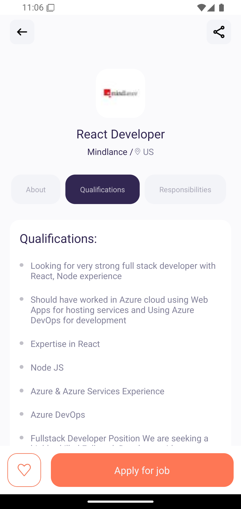
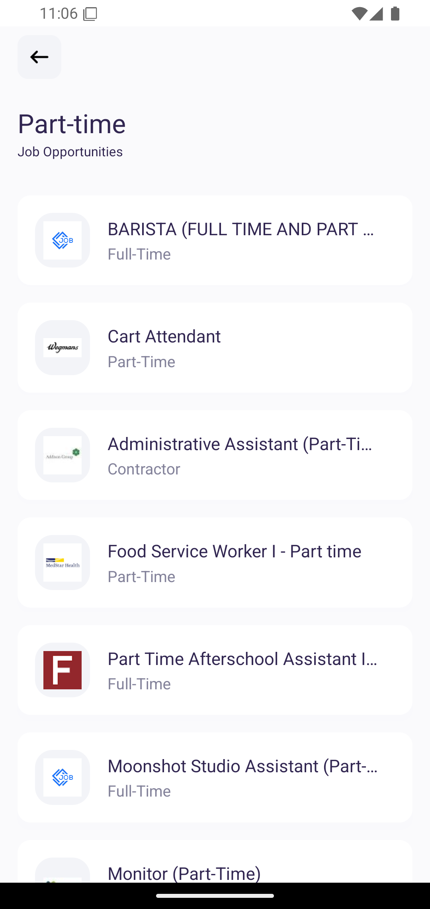
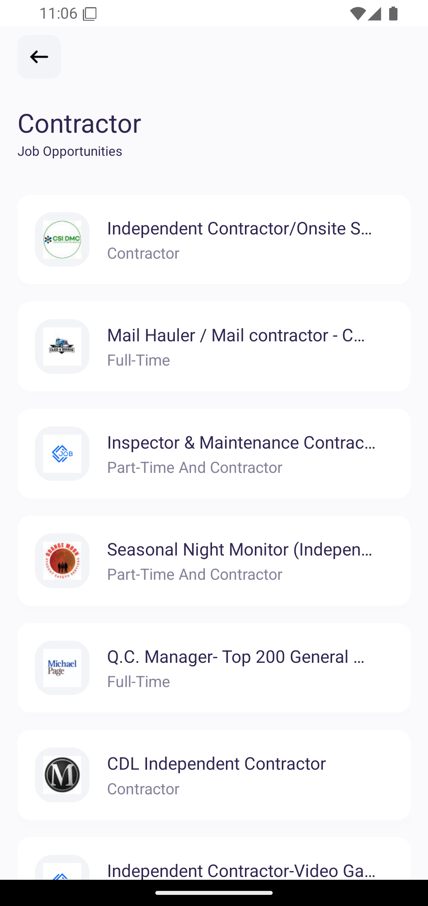
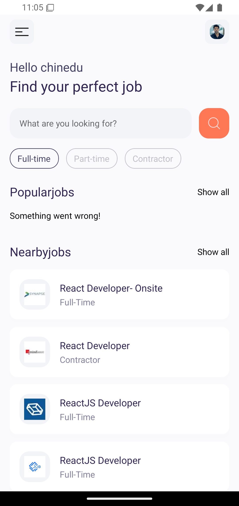
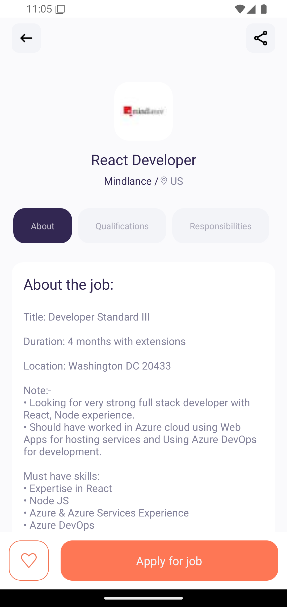

---
# 💼 Job Search Mobile App

A sleek, modern, and fast **Job Search mobile application** built with **React Native** using **Expo Router** and styled with **Tailwind CSS (NativeWind)**. This app connects to real-time job listings via **Rapid API**, offering users an intuitive experience to find and apply for jobs across various categories and locations.

<p align="center">


</p>
---

## 📸 Screenshots

<p align="center">
  
  
  
  
  
  
</p>

---

## 🚀 Features

- 🔍 **Search Jobs by Title, Location, or Category**
- 🏷️ **View Detailed Job Information**
- 📄 **Save/Bookmark Jobs**
- 🌐 **Real-time Listings from Rapid API**
- 🎨 **Tailwind CSS Styling (NativeWind)**
- ⚡ **Responsive UI & Smooth Navigation**
- 🌙 **Dark/Light Theme Ready (via system UI)**

---

## 🧰 Tech Stack

### 📱 Framework & Libraries

- **React Native** (Expo SDK 52)
- **Expo Router** for file-based navigation
- **Tailwind CSS** with **NativeWind** for styling
- **React Navigation** (Bottom Tabs & Native Stack)

### 🧠 Utilities & Tools

- **Axios** for API requests
- **React Native Reanimated** and Gesture Handler
- **Dotenv** for managing environment variables
- **Jest** + **Jest-Expo** for testing

### 🗄️ API

- 🔗 **[Rapid API](https://rapidapi.com/)** - Job listings integration

---

## 🗂️ Folder Structure

```bash
.
├── app/                   # Routes and screens (Expo Router)
│   ├── search/[id].tsx           # Tab-based navigation
│   ├── job-details/[id].tsx       # Job details screen
│   └── _layout.tsx        # Global layout wrapper
├── assets/                # Fonts, images, splash, etc.
├── components/            # Reusable UI components
├── constants/             # Static values (colors, endpoints, etc.)
├── hooks/                 # Custom React hooks
├── services/              # API service logic (Rapid API)
├── store/                 # Global state (if needed)
├── types/                 # TypeScript definitions
├── utils/                 # Helper functions
└── scripts/               # Project scripts (e.g., reset)
```

---

## ⚙️ Getting Started

### 1. Clone the Repository

```bash
git clone https://github.com/your-username/jobsearch-app.git
cd jobsearch-app
```

### 2. Install Dependencies

```bash
npm install
# or
yarn
```

### 3. Set Up Environment Variables

Create a `.env` file in the root and add your Rapid API credentials:

```env
RAPID_API_KEY=your_key_here
RAPID_API_HOST=your_host_here
```

### 4. Start Development Server

```bash
npx expo start
```

---

## 🧪 Testing

Run tests with:

```bash
npm test
```

Powered by **Jest** and **jest-expo**.

---

## 🤝 Contribution

We welcome all contributions! To contribute:

1. Fork the repo
2. Create your feature branch (`git checkout -b feature/something`)
3. Commit your changes (`git commit -m 'feat: Add something'`)
4. Push to the branch (`git push origin feature/something`)
5. Open a pull request

---

## 📄 License

This project is licensed under the **MIT License**.  
See the [LICENSE](./LICENSE) file for more details.

---

## 👨🏽‍💻 Author

**Chinedu Aguwa**  
📧 [neduaguwa443@gmail.com](mailto:neduaguwa443@gmail.com)  
📞 +234 810 547 1046  
[LinkedIn](https://www.linkedin.com/in/chinedu-aguwa-b1747a2b0) • [GitHub](https://github.com/chi2785443)
